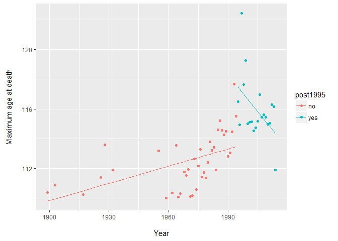
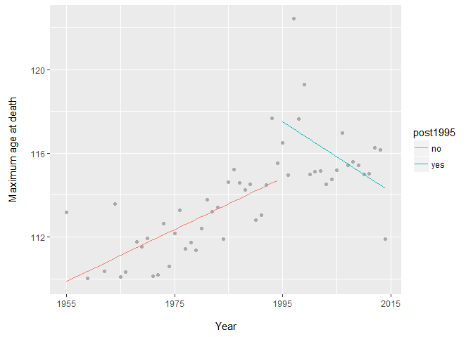
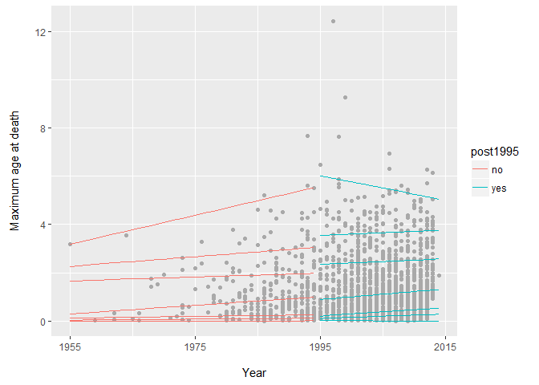

# Robust statistics show no evidence of limit to human lifespan

Dong, Milholland, and Vijg (2016) argue that human lifespan is limited. They base their analysis on supercentenarian data collected by the Gerontology Research Group which can be reached at www.grg.org. First, let's recreate the Dong et al. (2016) data and their analysis. 

    library(XML)
    library(stringr)
    library(ggplot2)
    library(plyr)
    library(dplyr)
    library(survival)
    library(quantreg)
    library(tidyr)

    # ---------------------- Create data ------------------- #

    # read data in
    theurl <- "http://www.grg.org/Adams/A_files/sheet001.htm"
    tables <- readHTMLTable(theurl,header=TRUE,skip.rows=1:12)
    dat <- tables[[1]][1:1627,]

    # format data set
    dat$Birthpl <- as.character(dat$Birthplace)
    dat$Deathpl <- as.character(dat$"Residence/Place of death")
    removeParsQM <- function(x)  unlist(strsplit(x,split=" \\(|\\?"))[1]

    dat$BirthC <- sapply(FUN=removeParsQM,X=dat$Birthpl)
    dat$DeathC <- sapply(FUN=removeParsQM,X=dat$Deathpl)
    dat$Dead <- ifelse(dat$Died=="",yes=0,no=1)
    dat$Age <-
        as.numeric(as.character(dat$Years))+(as.numeric(as.character(dat$Days))+0.5)/365.25
    dat2 <- dat

    # ---------------- Date of Death ------------------- #
    # set locale if it is not English for correct date conversion
    Sys.setlocale("LC_TIME", 'English')
    dD <- as.character(dat$Died)
    dD <- gsub("Sept.", "September", dD)
    deathDate <- as.Date(as.character(dD),"%b. %d, %Y")
    deathDate[is.na(deathDate)==TRUE] <-
        as.Date(as.character(dD)[is.na(deathDate)==TRUE],"%B %d, %Y")
    dat$deathDate <- deathDate
    dat2$deathDatePX <- as.POSIXlt(deathDate)
    dat2$deathYear <- dat2$deathDatePX$year+1900
   

Based on this data, Dong, Milholland, and Vijg (2016) argue that human
life expectancy is limited because if they fit a linear regression to
the annual maximum age at death to the data, they observe a trend
interrupted at 1995. Note that instead of using the full data set, they
constrain their findings to the points following 1950 (Extended Data
Figure 6).

    dat_lm <- dat2 %>%  mutate(age=Age,year=deathYear) %>% select(age,year,Dead) %>% filter(Dead==1) %>% 
              group_by(year) %>% summarise(max_age = max(age) ) %>% mutate(post1995=ifelse(year>=1995,"yes","no"),
                                                                           year=year-min(year))

Also note that this data is inherently biased becasuse it ignores the
different sample sizes at each age group and those supercentenarians who
are still alive at the end of the follow up.

    mod_dong_1 <- lm(data=dat_lm,max_age~year*post1995)
    summary(mod_dong_1)

    ## 
    ## Call:
    ## lm(formula = max_age ~ year * post1995, data = dat_lm)
    ## 
    ## Residuals:
    ##     Min      1Q  Median      3Q     Max 
    ## -2.4577 -1.2123 -0.0173  1.0650  5.2793 
    ## 
    ## Coefficients:
    ##                   Estimate Std. Error t value Pr(>|t|)    
    ## (Intercept)      109.79249    0.82004 133.886  < 2e-16 ***
    ## year               0.03852    0.01118   3.446  0.00110 ** 
    ## post1995yes       23.84918    6.95687   3.428  0.00116 ** 
    ## year:post1995yes  -0.20659    0.06633  -3.114  0.00293 ** 
    ## ---
    ## Signif. codes:  0 '***' 0.001 '**' 0.01 '*' 0.05 '.' 0.1 ' ' 1
    ## 
    ## Residual standard error: 1.686 on 55 degrees of freedom
    ## Multiple R-squared:  0.573,  Adjusted R-squared:  0.5497 
    ## F-statistic: 24.61 on 3 and 55 DF,  p-value: 3.151e-10

The model seems to work, as the fitted coefficients show, in 1899, at
the first year of death recorded in the data set Gert Adrians Boomgaard
was 110 year and 135 days old, almost the same as the intercept.
Following his death, maximum age has improved annually at the speed of
0.04 years per year, until 1995 when the intercept is already predicted
to be close to Jeanne Calment's death in 1997 at the age of 122.45.
Following her death, the predicted maximum lifespan quickly decreases at
the speed of (0.04-0.21=-0.17) years per year.

If we plot the data, we can immediately spot that such a large
difference arises because of the impact of outliers.

    preds <- predict(mod_dong_1)
    gp <- ggplot(dat_lm, aes(x = year, y = max_age, col = post1995)) 
    gp + geom_point() +  geom_line(aes(y = preds )) +  scale_y_continuous('Maximum age at death\n')+scale_x_continuous("\nYear",breaks=seq(1,121,30),labels=seq(1900,2020,30))

However, Dong, Milholland, and Vijg (2016) restricted their analysis to
the years following 1950.

    dat_lm_1950plus   <- dat_lm %>% filter(year>51) %>% mutate(year=year-min(year)) 
    mod_dong_1950plus <- lm(data=dat_lm_1950plus,max_age~year*post1995)
    summary(mod_dong_1950plus)

    ## 
    ## Call:
    ## lm(formula = max_age ~ year * post1995, data = dat_lm_1950plus)
    ## 
    ## Residuals:
    ##     Min      1Q  Median      3Q     Max 
    ## -2.4173 -1.1761 -0.0075  0.6909  5.2793 
    ## 
    ## Coefficients:
    ##                   Estimate Std. Error t value Pr(>|t|)    
    ## (Intercept)      109.87496    0.65441 167.900  < 2e-16 ***
    ## year               0.12348    0.02641   4.675 2.34e-05 ***
    ## post1995yes       14.35496    3.10175   4.628 2.73e-05 ***
    ## year:post1995yes  -0.29154    0.06633  -4.396 5.92e-05 ***
    ## ---
    ## Signif. codes:  0 '***' 0.001 '**' 0.01 '*' 0.05 '.' 0.1 ' ' 1
    ## 
    ## Residual standard error: 1.569 on 49 degrees of freedom
    ## Multiple R-squared:  0.6291, Adjusted R-squared:  0.6064 
    ## F-statistic:  27.7 on 3 and 49 DF,  p-value: 1.274e-10

    preds_1950plus <- predict(mod_dong_1950plus)
    gp <- ggplot(dat_lm_1950plus, aes(x = year, y = max_age, col = post1995)) 
    gp + geom_point(col="darkgrey") +  geom_line(aes(y = preds_1950plus )) +  scale_y_continuous('Maximum age at death\n')+scale_x_continuous("\nYear",breaks=seq(0,60,20),labels=seq(1955,2015,20))

As we can see, the post-1995 regression line very much influenced by
Jeanna Calment and Dorothy Baldwin whose maximum age at death in 2014 is
the only recorded death in 2014 as well.

Full sample, taking survivors into account
------------------------------------------

The approach above misses the crucial information that the maximums
arise of different sized samples who were exposed to the risk of death
at each year and that there are supercentenarians alive at the later
years in the data. Depending on when they join the data, they might bias
the dataset as they are likely to have a higher age at death than those
who are dead during the observation period.

Additionally, these life spans are already the extremes of human
longevity. For example, there are only 8 French supercentenarians born
in 1900 in the data from the birth cohort of some
[830,000](http://www.mortality.org/hmd/FRATNP/STATS/Births.txt) French
babies born in 1900. We might expect the extreme of the extremes be
subjective to randomness, and a more promising approach is to look at
the whole distribution of the extremes, similarly to the suggestion of
[Daniel
Wells](https://cdn.rawgit.com/daniel-wells/human-lifespan-limit/master/age-limit-analysis.nb.html).

Instead of a linear regression which fails to take the survivors into
account, a conditional quantile regression seem to be a better choice.
The quantile regression has the added benefit compared to the linear
regression that it can model the evolution of different quantiles, for
example the 90th quantile if a (trimmed) maximum of a sample is of
interest. Its results are also much more stable compared to selecting
the extremal values of the distribution as it is less sensitive to
randomness. Due to the small sample size, about 50-60 deaths maximum per
year, we might favor the 90th percentile compared to the 99th as we
might expect it to be less volatile.

Additionally, we should use a conditional quantile regression that
allows for right censoring of the supercentenarian lifespans who are
still alive at the end of the observation period.

    # create an indicator variable for before/after 1995
    dat2$post1995 <- ifelse(dat2$deathYear>=1995,1,0)
    # those who are alive shold be after 1995
    dat2$post1995[dat2$Dead==0]<- 1 
    # look at only the data after 1950 as in the article
    dat3<- subset(dat2,deathYear>1950)
    dat3$post1995 <- factor(dat3$post1995,labels=c("no","yes"))
    # instantiate a survival model with right censoring if supercentenarians are still alive at the end of follow-up
    surv <- Surv(time=dat3$Age-110,event=dat3$Dead)
    # fit a conditional quantile regression
    quantile_fit <- crq(data=dat3,surv~deathYear*post1995,method="Portnoy")

    pred_quantile <- predict(quantile_fit)
    # for some reason, I cannot get the function to predict only at the requested quantiles, 
    # so to get a predictoin at 0.01,0.1,0.2,0.5,0.8,0.9,0.99 
    # we can ask for the 2nd,8th, 14th, 33rd, 51st and 58th and 63rd columns of the prediction data frame, respectively.
    messy_preds <- pred_quantile[,c(2,8,14,33,51,58,63)]
    colnames(messy_preds) <- c(1,10,20,50,80,90,99)
    # tidy the predictions from wide to long format 
    tidy_preds <- as.data.frame(messy_preds) %>% gather(quantiles,Age) %>% mutate(Age=Age+110)
    tidy_preds$post1995<- rep(dat3$post1995,7)
    tidy_preds$deathYear<- rep(dat3$deathYear,7)

I placed the [summaries](##summaries) of the fit at the end of this page
to be less distracting. However, as visible on the plot for the 1st,
10th, 20th, 50th, 80th, 90th, 99th percentile below, only the highest
percentile, the 99th has an effect size large enough to yield
statistitically significant parameter estimates at *α* = 0.05.

Nevertheless, concentrating on the median (or the 90th percentile), a
conditional quantile regression fails to detect any decrease in the
annual age at death. It rather points to an interpretation of no change
since 1955, agreeing with the results of Jutta Gampe (Gampe 2010).

    gp_quantreg <- ggplot(dat3, aes(x = deathYear, y = Age-110, col = post1995)) 
    gp_quantreg2 <-gp_quantreg + geom_point(color="darkgrey") +   scale_y_continuous('Maximum age at death\n')+scale_x_continuous("\nYear",breaks=seq(1955,2015,20))
    for(quantile in c(1,10,20,50,80,90,99)) {
    gp_quantreg2 <- gp_quantreg2+geom_line(data=subset(tidy_preds,quantiles==quantile)) 
    }
    gp_quantreg2

Model for the median without trend break is more reasonable
-----------------------------------------------------------

Repeat the analysis without a break

    quantile_fit_no_break <- crq(data=dat3,surv~deathYear,method="Portnoy")
    # Break in 1995
    summary(quantile_fit_no_break,tau=c(0.5,0.9))

    ## 
    ## tau: [1] 0.5
    ## 
    ## Coefficients:
    ##             Value     Lower Bd  Upper Bd  Std Error T Value   Pr(>|t|) 
    ## (Intercept) -31.77248 -43.17546 -10.39709   8.36198  -3.79963   0.00014
    ## deathYear     0.01640   0.00567   0.02213   0.00420   3.90677   0.00009
    ## 
    ## tau: [1] 0.9
    ## 
    ## Coefficients:
    ##             Value      Lower Bd   Upper Bd   Std Error  T Value   
    ## (Intercept)  -48.77600 -166.58182   15.76167   46.51705   -1.04856
    ## deathYear      0.02604   -0.00637    0.08463    0.02322    1.12166
    ##             Pr(>|t|)  
    ## (Intercept)    0.29438
    ## deathYear      0.26201

and compare it with the trend break in 1995.

    # No break in 1995
    summary(quantile_fit,tau=c(0.5,0.9))

    ## 
    ## tau: [1] 0.5
    ## 
    ## Coefficients:
    ##                       Value     Lower Bd  Upper Bd  Std Error T Value  
    ## (Intercept)           -34.53477 -82.38387  17.80207  25.55811  -1.35123
    ## deathYear               0.01781  -0.00848   0.04182   0.01283   1.38777
    ## post1995yes            -7.70106 -80.34639  34.33797  29.25675  -0.26322
    ## deathYear:post1995yes   0.00380  -0.01718   0.04019   0.01464   0.25979
    ##                       Pr(>|t|) 
    ## (Intercept)             0.17662
    ## deathYear               0.16521
    ## post1995yes             0.79238
    ## deathYear:post1995yes   0.79503
    ## 
    ## tau: [1] 0.9
    ## 
    ## Coefficients:
    ##                       Value      Lower Bd   Upper Bd   Std Error 
    ## (Intercept)            -46.86432 -182.11297   48.47073   58.82345
    ## deathYear                0.02500   -0.02293    0.09297    0.02957
    ## post1995yes             31.14047 -132.64415  181.77582   80.21065
    ## deathYear:post1995yes   -0.01541   -0.09115    0.06664    0.04025
    ##                       T Value    Pr(>|t|)  
    ## (Intercept)             -0.79669    0.42563
    ## deathYear                0.84558    0.39779
    ## post1995yes              0.38823    0.69784
    ## deathYear:post1995yes   -0.38282    0.70185

Unfortunately the `quantreg` package does not provide an AIC or Anova
method for the conditional quantile regression class, so we are left to
rely on our intuitions to compare the models. However, we can see that
the model without a break is more appropriate for modeling the evolution
of the median as it returns statistically significant covariates and
would probably be just as good of a fit as the model with the break as
the estimated covariates as the intercept and deathYear trend estimates
of the models are very close to each other.

Conclusion
----------

Dong, Milholland, and Vijg (2016) argued that human life span is
limited. Part of their proof is the observed decreasing slope of annual
maximum age at death of supercentenarians. Dong, Milholland, and Vijg
(2016) used linear regressions to analyze this data but a re-analysis of
[Philipp Berens and Tom
Wallis](https://github.com/philippberens/lifespan) with more appropriate
extreme value distributions showed the sam effect. However,
supercentenarians already constitute the extremes of human longevity, we
might expect the extreme of the extremes be sensitive to random
variations, especially at limited sample sizes.

We could expect more robust results if we analyze the quantiles such as
the median or the 90th percentile instead of the maximum itself. An
advantage of the quantile regression is that it can take censoring into
account as well. In the supercentenarian dataset, there are surviving
supercentenarians who are excluded from a linear regression analysis but
as they are likely to have a higher age at death than those
supercentenarians who are already dead by the end of the observation
period, their absence might bias the parameter estimates downwards. Such
a quantile regression is called a conditional quantile regression.

The conditional quantile regression shows no signs of decreasing or
slowing human longevity after 1995 until the 95th percentile (not shown
here). However, higher percentiles, similarly to the analysis of the
maximums, exhibit a significant decrease but these results are prone to
random fluctuations due to the small sample size. For example, Jeanne
Calment who died in 1997 at the age of 122.45 provides is likely to
bring the 1995 maximum age at death estimate up and, consequently, the
after 1995 coefficient down.

If we observe a trimmed maximum such as the 90th percentile or an
indicator for the central tendency such as the median, we can see that
human longevity does not show a plateau -- the results rather indicate
that supercentenarian lifespan has not changed between 1995 and 2014, if
we believe in a trend model with a break in 1995. Alternatively, if we
think that there was no break in the trend in 1995, the median
supercentenarian lifespan even showed improvement but the 90th
percentile life span appeared to be fixed throughout this time period.

Summaries
---------

    # get the summaries of some interesting quantiles
    summary(quantile_fit, tau = c(0.01,0.1,0.2,0.5,0.8,0.9,0.99))

    ## 
    ## tau: [1] 0.01
    ## 
    ## Coefficients:
    ##                       Value    Lower Bd Upper Bd Std Error T Value 
    ## (Intercept)           -0.94714 -3.19916 -0.93892  0.57660  -1.64263
    ## deathYear              0.00048  0.00048  0.00163  0.00029   1.64217
    ## post1995yes           -1.63833 -4.15947 -0.82526  0.85058  -1.92614
    ## deathYear:post1995yes  0.00082  0.00041  0.00209  0.00043   1.92504
    ##                       Pr(>|t|)
    ## (Intercept)            0.10046
    ## deathYear              0.10055
    ## post1995yes            0.05409
    ## deathYear:post1995yes  0.05422
    ## 
    ## tau: [1] 0.1
    ## 
    ## Coefficients:
    ##                       Value     Lower Bd  Upper Bd  Std Error T Value  
    ## (Intercept)            -3.80015  -6.16012  -2.46037   0.94383  -4.02630
    ## deathYear               0.00196   0.00129   0.00317   0.00048   4.08135
    ## post1995yes           -14.48696 -25.89785   6.05116   8.15041  -1.77745
    ## deathYear:post1995yes   0.00726  -0.00300   0.01297   0.00408   1.78075
    ##                       Pr(>|t|) 
    ## (Intercept)             0.00006
    ## deathYear               0.00004
    ## post1995yes             0.07549
    ## deathYear:post1995yes   0.07495
    ## 
    ## tau: [1] 0.2
    ## 
    ## Coefficients:
    ##                       Value     Lower Bd  Upper Bd  Std Error T Value  
    ## (Intercept)            -7.30740 -40.71144  10.18527  12.98409  -0.56280
    ## deathYear               0.00380  -0.00503   0.02061   0.00654   0.58066
    ## post1995yes           -27.05679 -61.64040   6.98280  17.50624  -1.54555
    ## deathYear:post1995yes   0.01353  -0.00386   0.03075   0.00883   1.53298
    ##                       Pr(>|t|) 
    ## (Intercept)             0.57357
    ## deathYear               0.56147
    ## post1995yes             0.12221
    ## deathYear:post1995yes   0.12528
    ## 
    ## tau: [1] 0.5
    ## 
    ## Coefficients:
    ##                       Value     Lower Bd  Upper Bd  Std Error T Value  
    ## (Intercept)           -34.53477 -60.54336  28.88591  22.81401  -1.51375
    ## deathYear               0.01781  -0.01389   0.03112   0.01148   1.55139
    ## post1995yes            -7.70106 -61.23349  37.48307  25.18326  -0.30580
    ## deathYear:post1995yes   0.00380  -0.01901   0.03069   0.01268   0.29992
    ##                       Pr(>|t|) 
    ## (Intercept)             0.13009
    ## deathYear               0.12081
    ## post1995yes             0.75976
    ## deathYear:post1995yes   0.76424
    ## 
    ## tau: [1] 0.8
    ## 
    ## Coefficients:
    ##                       Value     Lower Bd  Upper Bd  Std Error T Value  
    ## (Intercept)           -13.77559 -80.73624   9.62690  23.05225  -0.59758
    ## deathYear               0.00792  -0.00379   0.04178   0.01162   0.68153
    ## post1995yes            -5.53324 -95.01603  87.85923  46.65271  -0.11860
    ## deathYear:post1995yes   0.00295  -0.04344   0.04743   0.02318   0.12743
    ##                       Pr(>|t|) 
    ## (Intercept)             0.55012
    ## deathYear               0.49554
    ## post1995yes             0.90559
    ## deathYear:post1995yes   0.89860
    ## 
    ## tau: [1] 0.9
    ## 
    ## Coefficients:
    ##                       Value      Lower Bd   Upper Bd   Std Error 
    ## (Intercept)            -46.86432 -100.39821   47.75863   37.79581
    ## deathYear                0.02500   -0.02244    0.05210    0.01902
    ## post1995yes             31.14047  -49.57225  212.78859   66.93002
    ## deathYear:post1995yes   -0.01541   -0.10605    0.02513    0.03346
    ##                       T Value    Pr(>|t|)  
    ## (Intercept)             -1.23993    0.21500
    ## deathYear                1.31472    0.18860
    ## post1995yes              0.46527    0.64174
    ## deathYear:post1995yes   -0.46047    0.64518
    ## 
    ## tau: [1] 0.99
    ## 
    ## Coefficients:
    ##                       Value      Lower Bd   Upper Bd   Std Error 
    ## (Intercept)           -124.61300 -134.95174 -115.81299    4.88243
    ## deathYear                0.06537    0.06087    0.07064    0.00249
    ## post1995yes            293.76243  204.47415  371.18175   42.52823
    ## deathYear:post1995yes   -0.14681   -0.18598   -0.10113    0.02165
    ##                       T Value    Pr(>|t|)  
    ## (Intercept)            -25.52276    0.00000
    ## deathYear               26.23504    0.00000
    ## post1995yes              6.90747    0.00000
    ## deathYear:post1995yes   -6.78266    0.00000

References
----------

Dong, Xiao, Brandon Milholland, and Jan Vijg. 2016. “Evidence for a
Limit to Human Lifespan.” *Nature* 538: 257–59.
doi:[doi:10.1038/nature19793](https://doi.org/doi:10.1038/nature19793).

Gampe, Jutta. 2010. “Human Mortality Beyond Age 110.” In
*Supercentenarians*, edited by Heiner Maier, Jutta Gampe, James W
Vaupel, Bernard Jeune, and Jean-Marie Robine, 219–30. Berlin,
Heidelberg: Springer.
