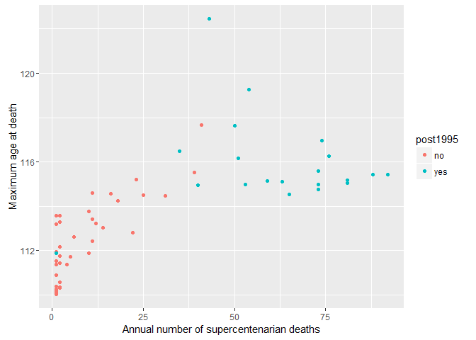

# Sample size is log-linearly related to maximum age at death of supercentenarians

Dong, Milholland, and Vijg (2016) argue that supercentenarian ages at
death show evidence of limit to human lifespan. In their analysis, they
look at the trend of the maximums and other order statistics (1st to
5th). However, they forget to take the relevant sample sizes into
account.

Let us first recreate the dataset.

    # load packages

    library(XML)
    library(stringr)
    library(ggplot2)

    # ---------------------- Create data ------------------- #

    # read data in
    theurl <- "http://www.grg.org/Adams/A_files/sheet001.htm"
    tables <- readHTMLTable(theurl,header=TRUE,skip.rows=1:12)
    dat <- tables[[1]][1:1627,]

    # format data set
    dat$Birthpl <- as.character(dat$Birthplace)
    dat$Deathpl <- as.character(dat$"Residence/Place of death")
    removeParsQM <- function(x)  unlist(strsplit(x,split=" \\(|\\?"))[1]

    dat$BirthC <- sapply(FUN=removeParsQM,X=dat$Birthpl)
    dat$DeathC <- sapply(FUN=removeParsQM,X=dat$Deathpl)
    dat$Dead <- ifelse(dat$Died=="",yes=0,no=1)
    dat$Age <-
        as.numeric(as.character(dat$Years))+(as.numeric(as.character(dat$Days))+0.5)/365.25
    dat2 <- dat
    dat2$Age <- dat$Age-110

    # create date of death as a numerical variable
    Sys.setlocale("LC_TIME", 'English')

    ## [1] "English_United States.1252"

    dD <- as.character(dat$Died)
    dD <- gsub("Sept.", "September", dD)
    deathDate <- as.Date(as.character(dD),"%b. %d, %Y")
    deathDate[is.na(deathDate)==TRUE] <-as.Date(as.character(dD)[is.na(deathDate)==TRUE],"%B %d, %Y")
    dat$deathDate <- deathDate
    dat2$deathDatePX <- as.POSIXlt(deathDate)
    dat2$deathYear <- dat2$deathDatePX$year+1900

After creating the data, we can look at the distribution of the annual
maximums and the annual number of deaths (sample sizes).

    dat3 = data.frame(death_year = dat2$deathYear,age=dat2$Age+110)
    year_age <- aggregate(data=dat3,age~death_year,FUN=max)
    year_count <- aggregate(data=dat3,age~death_year,FUN=length)
    year_age_count <- cbind(year_age,count=year_count$age)
    year_age_count$post1995 <- ifelse(year_age_count$death_year>=1995,1,0)

Before plotting the data, let's look at some simple correlations. Note
that the Pearson correlation coefficient tests whether there is a linear
relationship between two variables.

    cor(year_age_count)

    ##            death_year       age     count  post1995
    ## death_year  1.0000000 0.6254246 0.7027551 0.6522186
    ## age         0.6254246 1.0000000 0.7075253 0.6553857
    ## count       0.7027551 0.7075253 1.0000000 0.8572269
    ## post1995    0.6522186 0.6553857 0.8572269 1.0000000

If we look at the correlation matrix, we can see that the maximum age at
death (`age`) is strongly correlated with `death_year`, `count` and
`post1995` as well, and all of these variables are highly correlated
with each other as well.

If we test the correlation between maximum age at death and the number
of supercentenarian deaths,

    with(year_age_count,cor.test(age,count))

    ## 
    ##  Pearson's product-moment correlation
    ## 
    ## data:  age and count
    ## t = 7.5588, df = 57, p-value = 3.726e-10
    ## alternative hypothesis: true correlation is not equal to 0
    ## 95 percent confidence interval:
    ##  0.5513368 0.8157976
    ## sample estimates:
    ##       cor 
    ## 0.7075253

We get a proof of a strong linear relationship.

    summary(lm(data=year_age_count,age~count))

    ## 
    ## Call:
    ## lm(formula = age ~ count, data = year_age_count)
    ## 
    ## Residuals:
    ##     Min      1Q  Median      3Q     Max 
    ## -2.1734 -1.4622 -0.2807  1.0636  7.8177 
    ## 
    ## Coefficients:
    ##              Estimate Std. Error t value Pr(>|t|)    
    ## (Intercept) 1.120e+02  3.157e-01 354.864  < 2e-16 ***
    ## count       6.071e-02  8.031e-03   7.559 3.73e-10 ***
    ## ---
    ## Signif. codes:  0 '***' 0.001 '**' 0.01 '*' 0.05 '.' 0.1 ' ' 1
    ## 
    ## Residual standard error: 1.791 on 57 degrees of freedom
    ## Multiple R-squared:  0.5006, Adjusted R-squared:  0.4918 
    ## F-statistic: 57.14 on 1 and 57 DF,  p-value: 3.726e-10

If we plot the data of maximum age at death against, based on the
correlations, we would expect to see a strong linear relationship
between maximum ages at death and annual number of supercentenarian
deaths. Moreover, we would expect the year after 1995 having more
supercentenarian deaths than the years before 1995.

    year_age_count$post1995 <- factor(year_age_count$post1995,levels=c(0,1),labels=c("no","yes"))
    gp <- ggplot(data=year_age_count,aes(x=count,y=age,color=post1995))
    gp + geom_point()+scale_y_continuous("Maximum age at death")+scale_x_continuous("Annual number of supercentenarian deaths")

 

The plot suggests a logarithmic relationship between maximum age at death
and the number of supercentenarian deaths.

    gp <- ggplot(data=year_age_count,aes(x=log(count),y=age,color=post1995))
    gp + geom_point()+scale_y_continuous("Maximum age at death")+scale_x_continuous("Logarithm of the annual number of supercentenarian deaths")

Another interesting implication of these plots is that the number of
registered supercentenarian deaths seemed to level off at 1995 which in
turn might have created a false impression that the maximum age at death
levelled off.

The logarithmic transformation seems to linearize the plot, so we could
expect an even higher correlation coefficient between maximum age at
death and the logarithm of the annual number of supercentenarian deaths.

    with(year_age_count,cor.test(age,log(count)))

    ## 
    ##  Pearson's product-moment correlation
    ## 
    ## data:  age and log(count)
    ## t = 10.189, df = 57, p-value = 1.882e-14
    ## alternative hypothesis: true correlation is not equal to 0
    ## 95 percent confidence interval:
    ##  0.6891997 0.8787497
    ## sample estimates:
    ##       cor 
    ## 0.8034752

A Pearson correlation of 0.8 implies that the logarithm of the annual
number of supercentenarian deaths explains 64% of the variation in the
maximum ages at deaths in a linear regression fashion.

Conclusion
----------

The sample size and its extremes are tightly related. Just because of
randomness, a higher sample size is likely to have a higher maximum of
iid samples. Such a relationship is easily understandable and requires
no magical assumption of a break in the supercentenarian ages at death
in 1995. The data shows that such a break point in 1995 existed: the
Gerontology Research Group registered about the same number of
supercentenarian deaths each year following 1995 while this quantity was
growing in the previous years.

References
----------

Dong, Xiao, Brandon Milholland, and Jan Vijg. 2016. “Evidence for a
Limit to Human Lifespan.” *Nature* 538: 257–59.
doi:[doi:10.1038/nature19793](https://doi.org/doi:10.1038/nature19793).
